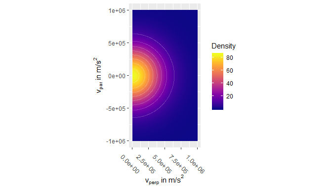
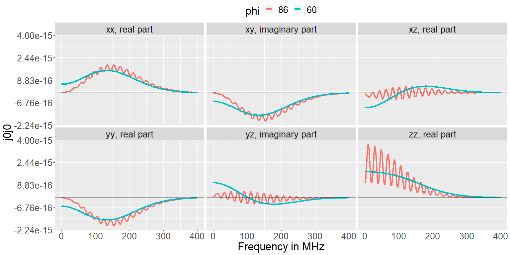

<!-- README.md is generated from README.Rmd. Please edit that file -->

# j0j0r

<!-- badges: start -->

<!-- badges: end -->

`j0j0r` is is an R-package built to calculate the unscreened current
correlation tensor of the plasma fluctuation model of [Bindslev 1996,
Journal of Atmospheric and Terrestial Physics, **58**,
983](https://www.sciencedirect.com/science/article/pii/0021916995001298).

The code is meant to be distribution-agnostic, i.e. it should be able to
handle any reasonable form of the momentum distribution. Integrals over
the momentum distribution are calculated numerically. Analytic
solutions, possible only in special cases, are not used/supported.

The package contains functions to set up a number of momentum
distribution types:

  - An isotropic Maxwellian distribution.

  - A bi-Maxwellian distribution with drift along the magnetic field.

  - A [generalized Lorentzian /
    Kappa](https://www.spenvis.oma.be/help/background/distributions/distributions.html)
    distribution.

  - A ring-distribution.

  - A bivariate normal distribution.

  - A slowdown distribution: an isotropic fast-ion slowdown with
    transport modifications as formulated by Wilkie 2018. See
    <https://arxiv.org/abs/1808.01934v2>.

Apart from those, users are free to input new distribution functions of
their own design.

## Installation

Install the development version from [GitHub](https://github.com/) with:

``` r
if (!require("devtools")) {
  install.packages("devtools")
}

devtools::install_github("mstejner/j0j0r")
```

The package is not yet on CRAN.

## Vignette

The example below shows the basic work flow for a Maxwellian
distribution. The package vignette gives a more thorough introduction
and a discussion of the effects of strongly non-Maxwellian
distributions. It can be viewed with:

``` r
devtools::build_vignettes()
vignette("j0j0r_intro")
```

And on <https://mstejner.github.io/j0j0r/> under articles.

## Example

To run the example below, first attach the `j0j0r` and `magrittr`
packages:

``` r
library(j0j0r)
library(magrittr)
```

The code is parallelized using the
[future](https://cran.r-project.org/web/packages/future/) and
[furrr](https://cran.r-project.org/web/packages/furrr/index.html)
packages. To make use of the parallelization, first set a plan for the
`future` package. Different plans will be appropriate for different
operating systems. On Windows it could be:

``` r
future::plan(strategy = "multisession")
```

A Maxwellian distribution can be set up with:

``` r
maxwellian_deuterium <- maxwellian_setup(
  n = 4e19,
  T_eV = 2000,
  A = 2,
  Z = 1,
  name = "maxwellian"
)
```

It can be evaluated and plotted with:

``` r
calculate_distribution_data_frame(
  particles = list(maxwellian_deuterium = maxwellian_deuterium), 
  v_par = seq(-1e6, 1e6, length.out = 300), 
  v_perp = seq(0, 1e6, length.out = 300) 
) %>% 
plot_dist() +
ggplot2::theme(
  text = ggplot2::element_text(size = 11),
  axis.text.x = ggplot2::element_text(angle = -45, size = 10)
) 
```



The elements of the current correlation tensor can now be calculated
with the `j0j0` function. Here assuming a magnetic field of 2.5 T, a
wave vector length corresponding to 3 mm waves, resolved angles of 60
and 86 degrees, and frequencies between 0 and 400 MHz.

``` r
maxwellian_example <- j0j0(
  k = 2 * pi / (j0j0r::const$c / 100e9),
  phi = c(60, 86),
  frequencies = seq(0, 400e6, by = 2e6),
  directions = c("x", "y", "z"),
  B = 2.5,
  particles = list(maxwellian = maxwellian_deuterium),
  integration_method = "hcubature"
)
```

The output is a tibble with results (j0j0) for all combinations of all
values of the input variables:

``` r
dplyr::glimpse(maxwellian_example)
#> Observations: 2,412
#> Variables: 10
#> $ k                  <dbl> 2095.845, 2095.845, 2095.845, 2095.845, 209...
#> $ phi                <dbl> 60, 86, 60, 86, 60, 86, 60, 86, 60, 86, 60,...
#> $ frequency          <dbl> 0.0e+00, 0.0e+00, 2.0e+06, 2.0e+06, 4.0e+06...
#> $ B                  <dbl> 2.5, 2.5, 2.5, 2.5, 2.5, 2.5, 2.5, 2.5, 2.5...
#> $ particle           <chr> "maxwellian", "maxwellian", "maxwellian", "...
#> $ integration_method <chr> "hcubature", "hcubature", "hcubature", "hcu...
#> $ directions         <chr> "xx", "xx", "xx", "xx", "xx", "xx", "xx", "...
#> $ A                  <dbl> 2, 2, 2, 2, 2, 2, 2, 2, 2, 2, 2, 2, 2, 2, 2...
#> $ Z                  <dbl> 1, 1, 1, 1, 1, 1, 1, 1, 1, 1, 1, 1, 1, 1, 1...
#> $ j0j0               <cpl> 5.984923e-16+0i, 5.095825e-18+0i, 5.990463e...
```

The results can be plotted with:

``` r
plot_j0j0(maxwellian_example, wrap_by = "element", color_by = "phi")
```


